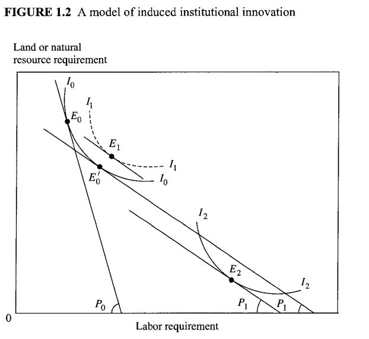

# Other Ideas (rough)


## Isoquant Edgeworth box plots

The model could be visualized on an Edgeworth Box isoquant diagram, and useful because it shows the effective $w/r$ (isocost lines) faced on unenclosed and enclosed sites.  

In our model thus far $G(T,L) = \theta \cdot F(T,L)$  but it might be interesting to argue that enclosure might facilitate the adoption of more labor-intensive technologies (e.g. irrigated crops, tree crops).  Otsuka and Place {cite}`otsuka2014` have a diagram describing such a Boserupian situation that we could provide microfoundations for in our model:



## Differentiated skill

We could have a skill distribution **s** and production of the form:

$$s_i^{1-\gamma} \left [T_i^\alpha L_i^{1-\alpha}     \right]^\gamma$$

Presumably now the more skilled would want to enclose earlier, generating interesting situations.  

This extension would be nice because it then allows us to talk to the 'misallocation' literatures that start from here and say the land rental market is malfunctioning and leading to misallocation.  We'd be potentially positioned to say that and more interesting things as well (e.g. political economy might be interesting...less productive farmers would stand to gain if they can now gain title to use-rights and then lease out land without fear to the more skilled... but maybe other considerations -- fallback subsistence land -- might play ar role.)


#### References Cited
```{bibliography} references.bib
```